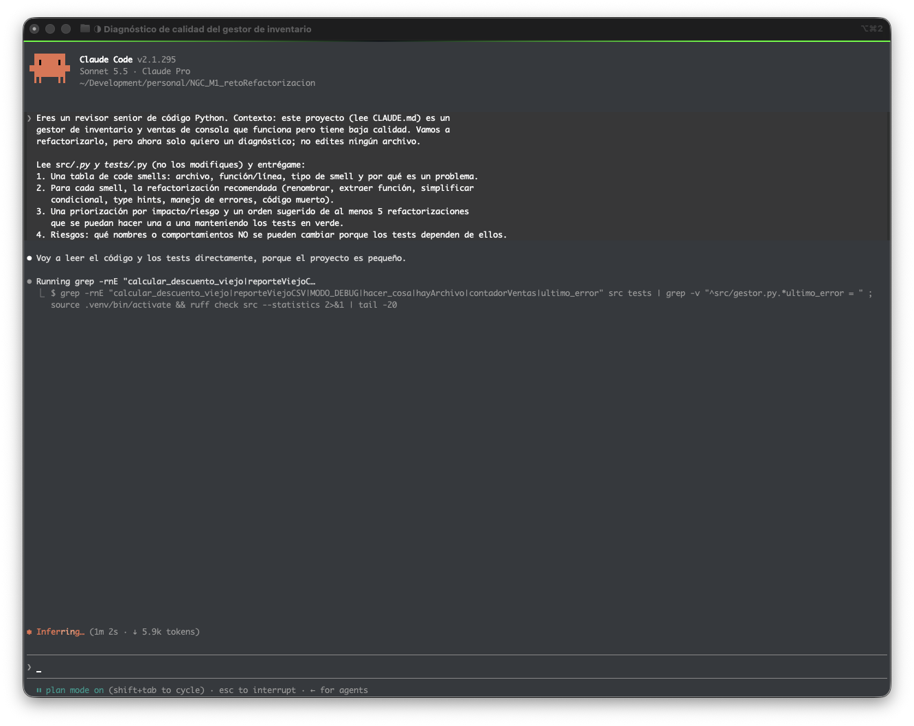
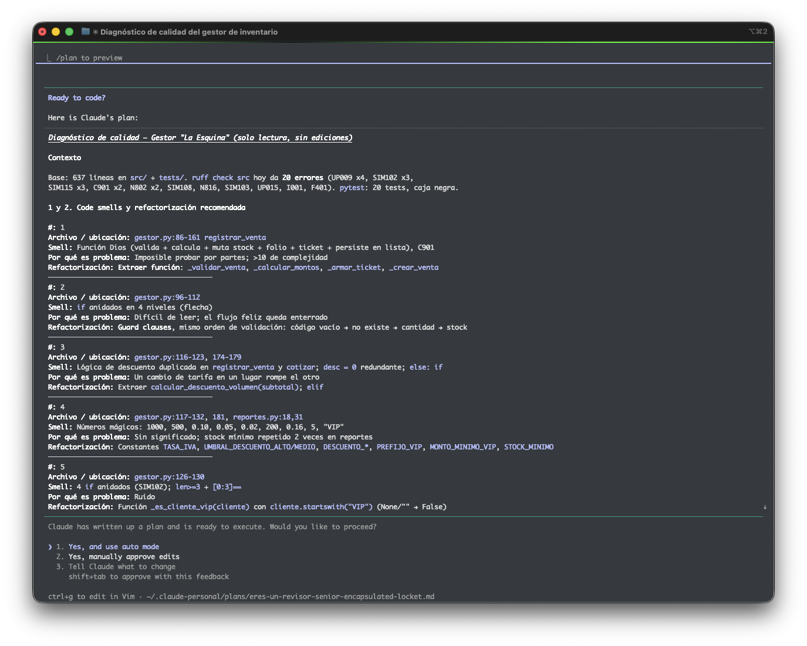

# Evidencia 01 — Diagnóstico de code smells (Claude Code, plan mode)

- **Fecha:** 2026-10-08
- **Herramienta:** Claude Code v2.1.295, modelo Sonnet 5.5, en **plan mode** (solo lectura, sin ediciones)
- **Contexto cargado:** `CLAUDE.md` del proyecto
- **Capturas:**
  - Prompt y arranque de la exploración (plan mode activo): 
  - Plan/diagnóstico entregado por Claude: 

## Prompt utilizado

```
Eres un revisor senior de código Python. Contexto: este proyecto (lee CLAUDE.md) es un
gestor de inventario y ventas de consola que funciona pero tiene baja calidad. Vamos a
refactorizarlo, pero ahora SOLO quiero un diagnóstico; no edites ningún archivo.

Lee src/*.py y tests/*.py (no los modifiques) y entrégame:
1. Una tabla de code smells: archivo, función/línea, tipo de smell y por qué es un problema.
2. Para cada smell, la refactorización recomendada (renombrar, extraer función, simplificar
   condicional, type hints, manejo de errores, código muerto).
3. Una priorización por impacto/riesgo y un orden sugerido de al menos 5 refactorizaciones
   que se puedan hacer una a una manteniendo los tests en verde.
4. Riesgos: qué nombres o comportamientos NO se pueden cambiar porque los tests dependen de ellos.
```

## Respuesta de Claude (texto íntegro)

```text
Diagnóstico de calidad — Gestor "La Esquina" (solo lectura, sin ediciones)

Contexto

Base: 637 líneas en src/ + tests/. ruff check src hoy da 20 errores (UP009 x4, SIM102 x3,
SIM115 x3, C901 x2, N802 x2, SIM108, N816, SIM103, UP015, I001, F401). pytest: 20 tests, caja negra.

1 y 2. Code smells y refactorización recomendada

#: 1
Archivo / ubicación: gestor.py:86-161 registrar_venta
Smell: Función Dios (valida + calcula + muta stock + folio + ticket + persiste en lista), C901
Por qué es problema: Imposible probar por partes; >10 de complejidad
Refactorización: Extraer función: _validar_venta, _calcular_montos, _armar_ticket, _crear_venta
────────────────────────────────────────
#: 2
Archivo / ubicación: gestor.py:96-112
Smell: if anidados en 4 niveles (flecha)
Por qué es problema: Difícil de leer; el flujo feliz queda enterrado
Refactorización: Guard clauses, mismo orden de validación: código vacío → no existe → cantidad → stock
────────────────────────────────────────
#: 3
Archivo / ubicación: gestor.py:116-123, 174-179
Smell: Lógica de descuento duplicada en registrar_venta y cotizar; desc = 0 redundante; else: if
Por qué es problema: Un cambio de tarifa en un lugar rompe el otro
Refactorización: Extraer calcular_descuento_volumen(subtotal); elif
────────────────────────────────────────
#: 4
Archivo / ubicación: gestor.py:117-132, 181, reportes.py:18,31
Smell: Números mágicos: 1000, 500, 0.10, 0.05, 0.02, 200, 0.16, 5, "VIP"
Por qué es problema: Sin significado; stock mínimo repetido 2 veces en reportes
Refactorización: Constantes TASA_IVA, UMBRAL_DESCUENTO_ALTO/MEDIO, DESCUENTO_*, PREFIJO_VIP, MONTO_MINIMO_VIP, STOCK_MINIMO
────────────────────────────────────────
#: 5
Archivo / ubicación: gestor.py:126-130
Smell: 4 if anidados (SIM102); len>=3 + [0:3]==
Por qué es problema: Ruido
Refactorización: Función _es_cliente_vip(cliente) con cliente.startswith("VIP") (None/"" → False)
────────────────────────────────────────
#: 6
Archivo / ubicación: gestor.py:149-158
Smell: Ticket armado concatenando t = t + ...
Por qué es problema: Frágil, ilegible
Refactorización: _armar_ticket(venta, hay_descuento) con f-strings/"\n".join (cuidar str(round(..)))
────────────────────────────────────────
#: 7
Archivo / ubicación: gestor.py (x, aux, temp2, desc, t, k) ; reportes.py (temp2, aux, t, s, temp, i/j) ; almacen.py (d, f) ; main.py (op,c,n,p,s,cli,v,t, temp2)
Smell: Nombres sin significado (prohibidos por CLAUDE.md); temp2 significa 3 cosas distintas
Por qué es problema: Ilegible
Refactorización: Renombrar: producto, subtotal, descuento, ticket, coincidencias…
────────────────────────────────────────
#: 8
Archivo / ubicación: reportes.py:9 hacer_cosa
Smell: Nombre prohibido, sin hint
Por qué es problema: No dice qué hace
Refactorización: Renombrar a formatear_dinero(valor: float) -> str (⚠ mantener "$" + str(round(v, 2)): da $23.2, no $23.20)
────────────────────────────────────────
#: 9
Archivo / ubicación: gestor.py:185 calcular_descuento_viejo; reportes.py:83 reporteViejoCSV; gestor.py:17 MODO_DEBUG; gestor.py:193-198 bloque comentado; reportes.py:4 import os
Smell: Código muerto (grep: 0 usos en src/ y tests/)
Por qué es problema: Confunde, N802, SIM115, F401
Refactorización: Eliminar
────────────────────────────────────────
#: 10
Archivo / ubicación: gestor.py:29-50 agregarProducto
Smell: Construcción de dict en 5 líneas; comentario # en vez de docstring; sin hints
Por qué es problema: Verboso
Refactorización: Literal {...}; docstring + hints (nombre debe quedar)
────────────────────────────────────────
#: 11
Archivo / ubicación: gestor.py:53-74 eliminar_producto, actualizar_stock, cotizar
Smell: Patrón global ultimo_error + set + return repetido ~12 veces; aux en vez de nombre
Por qué es problema: Repetición
Refactorización: Helper privado _registrar_error(mensaje); renombrar aux→nuevo_stock. No cambiar el mecanismo (main lee gestor.ultimo_error)
────────────────────────────────────────
#: 12
Archivo / ubicación: gestor.py:77-83 buscarProducto
Smell: Bucle con append, indexa INVENTARIO[k] 2 veces
Por qué es problema: Poco idiomático
Refactorización: List comprehension sobre .values(); conservar nombre
────────────────────────────────────────
#: 13
Archivo / ubicación: gestor.py:15 contadorVentas (N816, camelCase, global mutable usado en almacen.py:15,44)
Smell: Estado global + naming
Por qué es problema: Viola PEP 8
Refactorización: Renombrar a contador_ventas en gestor y almacen a la vez. No agregar estado global nuevo
────────────────────────────────────────
#: 14
Archivo / ubicación: almacen.py:16-18, 30-37
Smell: open sin with (SIM115); en cargar_datos el archivo queda abierto si falla algo ≠ el except; except Exception genérico
Por qué es problema: Fugas de recurso, oculta errores
Refactorización: with open(...); capturar json.JSONDecodeError/ValueError (JSONDecodeError y UnicodeDecodeError son subclases de ValueError)
────────────────────────────────────────
#: 15
Archivo / ubicación: almacen.py:38-43
Smell: Copia elemento a elemento en vez de update/extend; d["inventario"] sin guard (KeyError sin manejar si falta clave)
Por qué es problema: Verboso
Refactorización: INVENTARIO.update(...), VENTAS.extend(...), mantener clear() (in-place). No "arreglar" el KeyError: cambia comportamiento
────────────────────────────────────────
#: 16
Archivo / ubicación: almacen.py:10-19 guardar_datos
Smell: Siempre devuelve True; d sin nombre
Por qué es problema: Menor
Refactorización: Renombrar, with, hints; conservar el True
────────────────────────────────────────
#: 17
Archivo / ubicación: almacen.py:48-53 hayArchivo
Smell: N802 + SIM103 (if cond: return True else: return False) + camelCase
Por qué es problema: Redundante
Refactorización: hay_archivo → return os.path.exists(ruta); actualizar main.py:23 (no la usan tests)
────────────────────────────────────────
#: 18
Archivo / ubicación: reportes.py:48-66 mas_vendidos
Smell: Ordenamiento de burbuja manual + acumulador manual
Por qué es problema: O(n²), TODO admitido
Refactorización: sorted(..., key=lambda par: par[1], reverse=True)[:n]. Equivalente: burbuja con < estricto es estable y reverse=True también conserva el orden de empates
────────────────────────────────────────
#: 19
Archivo / ubicación: reportes.py:23-37, 69-80
Smell: Reportes imprimen y retornan (efecto lateral + valor); concatenación s = s + ...
Por qué es problema: Mezcla responsabilidades
Refactorización: Solo extraer _formatear_linea_producto; mantener print + return (comportamiento observable)
────────────────────────────────────────
#: 20
Archivo / ubicación: reportes.py:40-45 total_vendido / productos_stock_bajo
Smell: Bucle acumulador manual / temp2
Por qué es problema: —
Refactorización: sum(...), comprehension (OJO: round(sum(),2) con floats: mismo orden de suma, igual resultado; sum empieza en 0 int como el original)
────────────────────────────────────────
#: 21
Archivo / ubicación: main.py:21-82 menu
Smell: Función larga, if/elif de 8 ramas, C901, variables de 1 letra, input y lógica mezclados
Por qué es problema: Imposible de mantener
Refactorización: Extraer _opcion_agregar_producto, _opcion_registrar_venta, … y un dict {"1": fn, ...}; guard clause para "Opción no válida"
────────────────────────────────────────
#: 22
Archivo / ubicación: main.py:41,48,57
Smell: int(pedir_numero(...)) trunca decimales (3.9 → 3); pedir_numero devuelve float
Por qué es problema: Sorpresivo, pero es comportamiento actual
Refactorización: Documentar, no corregir; extraer pedir_entero solo si conserva int(float(x))
────────────────────────────────────────
#: 23
Archivo / ubicación: main.py:24
Smell: Ignora el retorno de cargar_datos y siempre imprime "Datos cargados"
Por qué es problema: Bug latente / mensaje engañoso
Refactorización: Anotar como hallazgo; cambiarlo altera la salida → fuera de alcance
────────────────────────────────────────
#: 24
Archivo / ubicación: Todos los módulos
Smell: # -*- coding: utf-8 -*- (UP009 x4), sin type hints, docstrings inconsistentes (# vs """), imports desordenados en main (I001)
Por qué es problema: Ruido de estilo
Refactorización: ruff --fix (revisar diff), hints + docstrings en español
────────────────────────────────────────
#: 25
Archivo / ubicación: gestor.py:164-182 cotizar vs registrar_venta
Smell: Inconsistencia de comportamiento: cotizar NO aplica descuento VIP y valida distinto (no revisa código vacío → "producto no existe", no revisa stock)
Por qué es problema: Cotización ≠ venta para VIP
Refactorización: Solo documentar. NO unificar (cambiaría resultados); al extraer helpers respetar ambos órdenes

3. Priorización (impacto / riesgo) y orden sugerido

Prioridad | Refactor                                                                             | Impacto            | Riesgo
1         | Eliminar código muerto + import os                                                   | Bajo-medio         | Muy bajo
2         | ruff --fix seguro (UP009, I001, UP015)                                               | Bajo               | Muy bajo
3         | Renombrar variables/funciones sin significado (hacer_cosa, temp2, aux, hayArchivo…)  | Alto (legibilidad) | Bajo
4         | Constantes en vez de números mágicos                                                 | Medio-alto         | Bajo (preservar orden de operaciones float)
5         | Extraer calcular_descuento_volumen + _es_cliente_vip, eliminar duplicado con cotizar | Alto               | Medio
6         | registrar_venta: guard clauses + extraer _armar_ticket/_crear_venta (baja C901)      | Muy alto           | Medio
7         | almacen.py: with open, excepción específica, simplificar carga                       | Medio              | Bajo-medio
8         | mas_vendidos con sorted                                                              | Medio              | Bajo
9         | main.menu en handlers + dict (baja C901)                                             | Medio              | Medio (sin tests: probar a mano)
10        | Type hints + docstrings en todo lo tocado, contadorVentas→contador_ventas            | Medio              | Bajo (el rename toca gestor+almacen juntos)

Cada paso = un commit refactor: ... con pytest + ruff check src en verde y entrada en la bitácora.

4. Riesgos — lo que NO se puede cambiar

Nombres exigidos por tests: agregarProducto, buscarProducto (también ignore-names en pyproject.toml),
reiniciar_sistema, actualizar_stock, eliminar_producto, registrar_venta, cotizar,
gestor.INVENTARIO, gestor.VENTAS, almacen.guardar_datos/cargar_datos,
reportes.productos_stock_bajo/total_vendido/mas_vendidos/reporte_inventario.
(ultimo_error, contadorVentas, hayArchivo, hacer_cosa NO están en tests, pero sí en main.py/almacen.py: renombrar en todos los usos a la vez.)

Comportamiento:
- Retornos booleanos reales (is True/False), None en fallos de venta/cotización; venta["folio"] int desde 1; el folio continúa tras recargar.
- INVENTARIO/VENTAS deben mutarse in place (clear(), no reasignar): los tests y almacen los referencian vía gestor..
- Claves de los dicts (codigo, nombre, precio, stock; folio, codigo, nombre, cantidad, subtotal, descuento, impuesto, total, cliente, fecha, ticket) y del JSON (inventario, ventas, contador), indent=2, ensure_ascii=False.
- Aritmética: desc = aux*0.10/0.05, VIP + aux*0.02 si aux - desc > 200, impuesto = base*0.16, round(base+impuesto, 2); no reescribir como base*1.16 (puede variar el redondeo). Umbrales con >=.
- Orden de validaciones y mensajes de ultimo_error ("codigo vacio", "el producto ya existe", "precio invalido", "stock invalido", "producto no existe", "cantidad invalida", "stock insuficiente", "el stock no puede quedar negativo", "el archivo no existe", "archivo corrupto").
- Formato de dinero "$" + str(round(v, 2)) (sin forzar 2 decimales); ticket omite la línea "Descuento" cuando desc == 0; stock bajo es < 5 (estricto).
- VIP es sensible a mayúsculas; cotizar no aplica VIP (ver #25).
- mas_vendidos: orden descendente, empates en orden de primera aparición.
- reporte_inventario/resumen_ventas siguen haciendo print y return.
- Restricciones del CLAUDE.md: no tocar tests/, pyproject.toml, .venv/, docs/evidencia/; sin estado global nuevo ni dependencias.

Verificación (cuando se ejecute cada refactor)

source .venv/bin/activate && pytest && ruff check src, más prueba manual de main.py (ojo: opción 8 sobrescribe datos_ejemplo.json; restaurar con git checkout datos_ejemplo.json).
```
